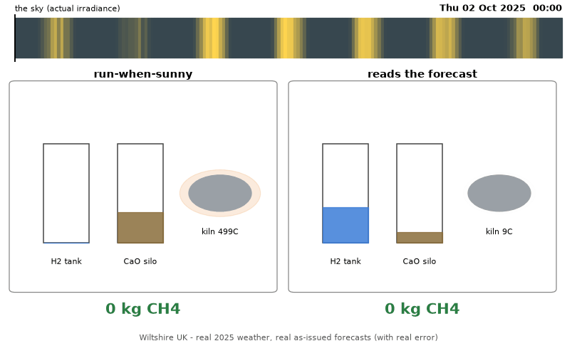
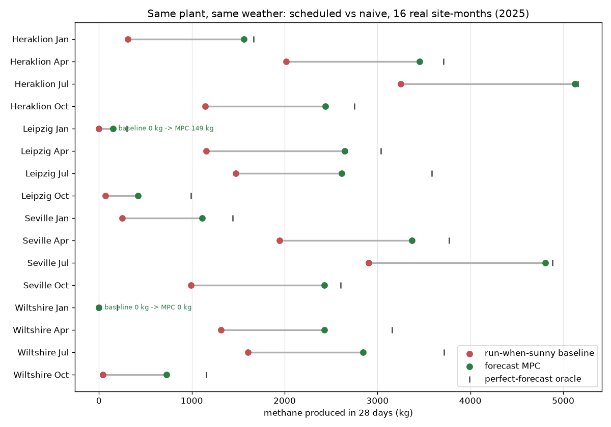

# Kilncast

*Buffer atoms, not electrons - an open digital twin of a solar-to-methane
plant, scheduled against real archived weather forecasts.*



- **+90% methane vs run-when-sunny** - same hardware, 4 European sites x 4
  seasons of real 2025 weather and real as-issued forecasts
  <!--NUM:headline_uplift-->
- **~70% of the perfect-hindsight gap closed** - against honest 7-day
  forecast error <!--NUM:gap_closed-->
- **Wiltshire, January: baseline 0 kg, forecast-MPC 92 kg** - the naive plant
  made nothing all month in Rivan's own county <!--NUM:wiltshire_jan-->

Built for [SoTA Commission II: Intermittent Abundance](https://sotaletters.substack.com/p/sota-commission-ii-intermittent-abundance).

## Quickstart

```bash
uv sync
uv run python scripts/run_controllers.py   # one command: five controllers, one comparison table
```

Weather data is fetched from Open-Meteo on first run and cached locally.

## What this is

A remote solar plant is only economical if it runs itself. This repo is a
simulation environment for exactly that problem, plus the controllers to
solve it, plus the evidence:

- **The plant**: solar -> alkaline electrolyser -> H2; calcium-looping DAC
  (900C kiln, CaCO3/CaO silo) -> CO2; Sabatier reactor -> pipeline methane.
  Modelled at operating-curve level from [Rivan's published figures](curves/rivan-v1.yaml) -
  every parameter tagged `source: rivan-* | literature | chemistry | assumed`.
- **The weather**: real ERA5 actuals plus real *as-issued* forecasts
  (Open-Meteo previous-runs archive, lead days 1-7) - schedulers are
  backtested against the forecast error that actually happened, not
  synthetic noise. Beyond day 7 a strictly-trailing climatology fills the
  brief's 10-day horizon (a stated assumption, tested for lookahead leakage).
- **The rule**: controllers PROPOSE, the plant ENFORCES. Islanded power,
  minimum loads, buffer capacities, kiln temperature and stoichiometry are
  applied by clipping, and every clip is logged - no strategy can cheat
  physics, so comparisons are legitimate.

Nothing open couples these three things - real forecast error, subsystem
dynamics with faults, and capex economics - for a real, named plant.
Design-time tools (NREL HOPP/H2Integrate) and single-unit RL benchmarks
(PC-Gym) both stop short; Gorre et al. 2020 sized the buffers we schedule.

## The controllers

| controller | one line |
|---|---|
| `baseline` | run everything when the sun shines; the named baseline in every claim |
| `heuristic` | pace the reactor overnight, follow the sky, hold kiln heat by forecast |
| `heuristic-tuned` | the strongest rulebook we could write: kiln matched to stoichiometric demand |
| `mpc` | rolling-horizon MILP over the midnight forecast (HiGHS); replans daily |
| `oracle` | the same optimiser fed actual weather - the ceiling that prices forecast uncertainty |

The MPC's internal model is the plant's exact dynamics, so its gap to the
oracle measures forecast error alone - and zero model mismatch is also a
stated limitation, not a virtue.

## Results



Full table: [docs/figures/sweep_table.csv](docs/figures/sweep_table.csv).
Committed result summaries live under [results/](results/); hourly series
regenerate with `uv run python experiments/sweep.py`.

The geographic finding: northern sites gain the most from scheduling and
close the least of the oracle gap - scheduling matters most, and forecasts
help least, exactly where the sun is scarce.

## The storm week

```bash
python -m http.server 8777 --directory dashboard
```

Open http://localhost:8777 - a replayable week where the forecast-aware
plant banks heat, hydrogen and calcined feedstock before a front arrives
while the naive plant stalls. Fault replays (kiln heater failure ->
detection -> replan -> recovery) are on the second tab.

## What didn't work

Failures are findings; these are ours:

- **A battery never paid for itself** at any 2026 price (50-250 GBP/kWh),
  and under realistic forecasts a deterministic MPC used it to do WORSE -
  storage amplifies plan leverage on forecast error. Solving harder made it
  worse, consistent with the optimizer's curse. Robust/stochastic MPC is the
  named next step. <!--NUM:battery-->
- **Hand rules barely dent the problem** - even the tuned rulebook trails
  the MPC badly. <!--NUM:heuristics-->
- **The salvage-value trap**: terminal store credits near methane's marginal
  value made the optimiser hoard buffers and never start the kiln.
- **Perfect information isn't automatically a ceiling**: our forecast MPC
  briefly beat the "oracle" until standby overheads were modelled - tight
  optimal plans are fragile to unbudgeted loads (see git history for the
  full sequence; standby draws were later zeroed as a documented assumption).

## Assumptions and honesty

- As-issued forecasts exist to lead day 7; days 8-10 use trailing
  climatology computed only from pre-issue data (a test poisons the future
  to prove it).
- Hot standby is passive (zero draw) for the electrolyser and reactor;
  start-up draws and the kiln's hold power are modelled explicitly.
- CaO sorbent inventory is assumed non-binding; the 48 h silo cap proxies it.
- Capex figures are deliberately conservative (~4x Rivan's target), so
  absolute GBP/kg is high and only RELATIVE comparisons are claimed.
- Plant sizing (electrolyser/kiln/absorber ratios) is `assumed`; the uplift
  magnitude is conditional on it.
- Solver noise is measured, not assumed: see `experiments/noise_band.py`
  and results/noise_band/. Claims smaller than the band are reported as
  indistinguishable from zero.
- Known data quirk: at Wiltshire the archive's lead-1 forecast is WORSE than
  lead-2 in every quarter, with a systematic -32 W/m2 under-forecast bias
  (likely a model-blend change at short lead for that location; Seville
  shows no such bias). Direction of impact: the MPC plans conservatively on
  same-day forecasts there, slightly understating its achievable uplift.
- Published sweep scope is 4 sites x 4 seasonal months (28-day windows);
  every coverage cap is logged, never silent.
- Fault recovery uses a repair notification (a human event), not autonomous
  re-probing.

## Reproduce everything

```bash
uv run pytest                                        # physics + honesty tests
uv run python experiments/sweep.py                   # the headline table
uv run python experiments/faults.py 2025-07-01       # fault campaign
uv run python experiments/battery.py                 # the battery on trial
uv run python experiments/noise_band.py              # the noise floor
uv run python experiments/aggregate.py               # figures from results
uv run python scripts/make_storm_gif.py              # the GIF above
```

## Model your own plant

Every operating number lives in [curves/rivan-v1.yaml](curves/rivan-v1.yaml).
Swap the file, keep the harness: the environment, the real-forecast
backtesting and the controllers are plant-agnostic.

## Layout

```
curves/       operating curves - the swappable plant definition
sim/          weather, subsystems, plant, economics, gym-style env
control/      baseline, heuristics, MILP MPC, oracle
experiments/  sweep, faults, battery, noise band, aggregation
dashboard/    static replay dashboard (no build step)
scripts/      one-off tools incl. the GIF renderer
tests/        conservation, no-lookahead, constraint enforcement
```

License: MIT. Built by [Liam Harte](https://rephobia.com).
